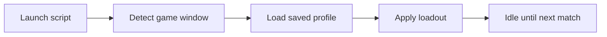

# ability-arena-script

*A standalone Windows companion for Ability Arena players who want faster setup and fewer repetitive clicks between rounds.*

## What this is

Ability Arena Script is a small Windows utility built around one game: Ability Arena. Instead of a browser extension or a game-side mod, it runs as its own app alongside the game and automates the parts of the match loop that players repeat manually — menu navigation, loadout selection, and post-match resets.

|                | Without Ability Arena Script | With Ability Arena Script |
|----------------|-------------------------------|-----------------------------|
| Loadout setup  | Manual, every match           | Applied automatically at launch |
| Post-match flow| Click through menus each time | Handled in the background |
| Install effort | N/A                           | Single download, no build steps |
| Updates        | Depends on game patches       | Tracked release by release |

The project exists because Ability Arena's UI is fast-paced but repetitive between matches. This tool doesn't change the game itself — it removes friction around it.

  

That button opens the project's landing page, where the current build is available to download.

## Who it is for

- **Regular Ability Arena players** who play many matches in a row and want less clicking between them.
- **Community moderators and event runners** who need consistent loadout setups across sessions.
- **Streamers** who want a predictable, repeatable pre-match routine on camera.
- **Contributors** interested in Windows tooling for niche multiplayer games.
- **Testers** who want to try new builds before they reach a wider audience.

## What you can do

- **Auto-apply a saved loadout** the moment a match window opens.
- **Skip repeated menu steps** between rounds without touching the mouse.
- **Save multiple loadout profiles** and switch between them in seconds.
- **Run alongside the game** without modifying game files.
- **Restore default settings** with a single reset action.
- **Check for updates** from inside the app itself.
- **Log basic session activity** for your own troubleshooting.
- **Close cleanly** without leaving background processes running.

## Getting started

1. Open the [landing page](https://MomentumBit65.github.io/ability-arena-script/).
2. Download the latest Windows build listed there.
3. Extract the folder if it arrives zipped.
4. Run the `.exe` and let Windows Defender's SmartScreen prompt pass (see Troubleshooting).
5. Launch Ability Arena, then start the script — it will detect the running game window.

## Requirements

- Windows 10 or Windows 11 (64-bit).
- Ability Arena installed and reachable from your account.
- No separate runtime, compiler, or package manager needed — it's a standalone executable.
- Roughly 100 MB of free disk space.

## How it works

The app watches for the Ability Arena process, then applies your saved preferences the moment the game window is ready.

1. You launch the script before or after starting the game.
2. It waits for the Ability Arena window to become active.
3. Your saved profile is read from local storage.
4. The loadout is applied automatically.
5. The script stays idle and reapplies the profile on the next match.

## FAQ

**Is Ability Arena Script safe to run alongside the game?**
It runs as a separate process and does not alter Ability Arena's files. It only automates actions you could otherwise do manually through the UI.

**Does it need to be updated every time Ability Arena patches?**
Usually not for minor patches. Larger UI changes in the game may require a matching update, which is announced on the landing page.

**Can I use more than one loadout profile?**
Yes — you can save several profiles and switch between them before a match starts.

**Is there a Mac or Linux version?**
Not currently. The project targets Windows 10/11 only.

**Why did Windows show a warning when I opened it?**
This is common for smaller, independently distributed Windows apps. See Troubleshooting below.

## Troubleshooting

- **SmartScreen warning on first launch** — click "More info," then "Run anyway." This appears because the app isn't signed with an EV certificate, not because of malicious behavior.
- **Script doesn't detect the game window** — make sure Ability Arena is fully loaded into a match or menu before starting the script, not still on the launcher screen.
- **Loadout doesn't apply** — confirm the profile is selected and saved; a blank profile will simply do nothing.
- **App won't close from the taskbar** — use Task Manager to end the process if the window becomes unresponsive, then relaunch.

## License

Released under the [MIT License](LICENSE). This project is provided as-is, with no warranty, and is not affiliated with or endorsed by the developers of Ability Arena.

  

